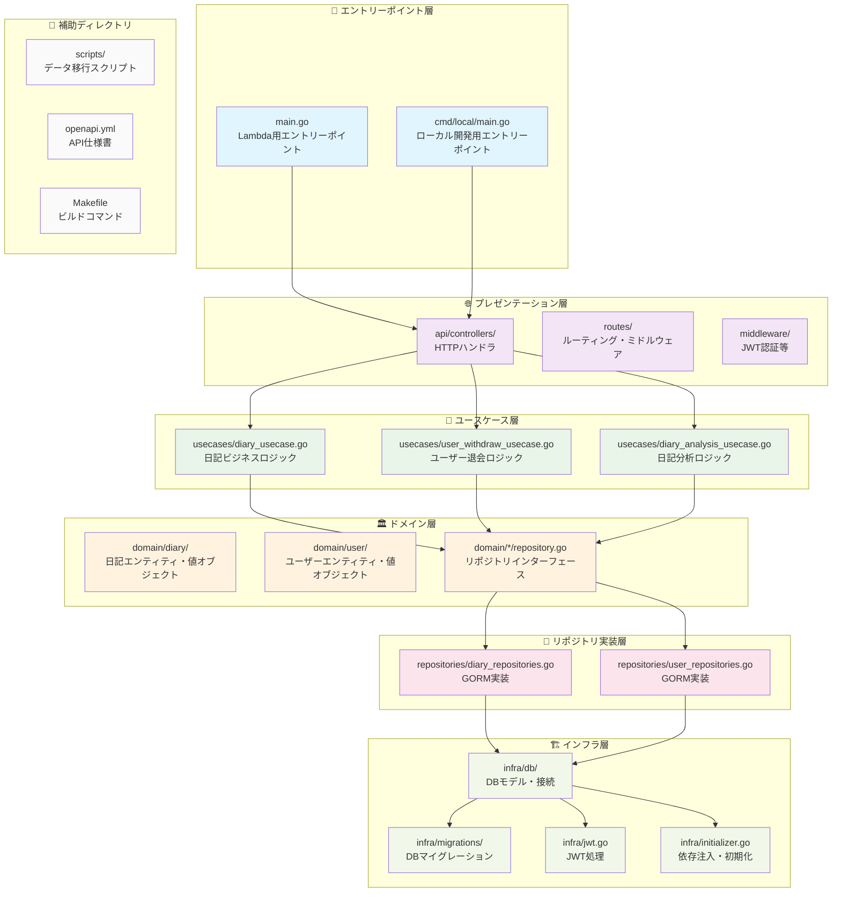
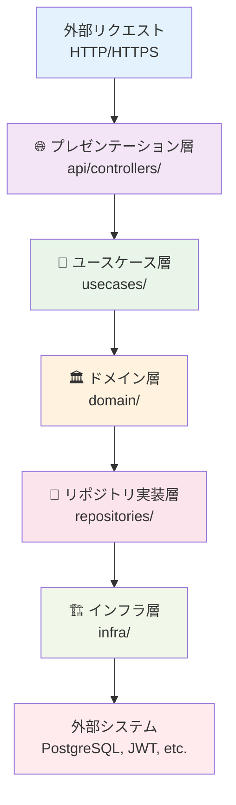
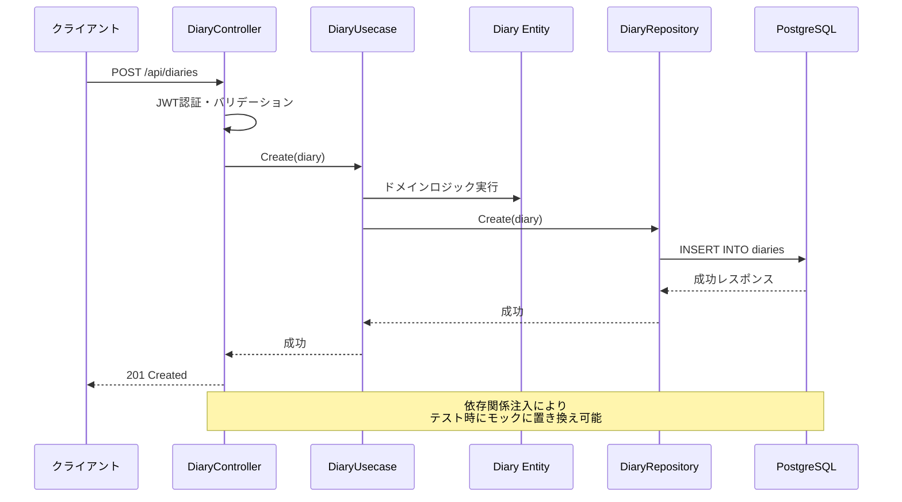
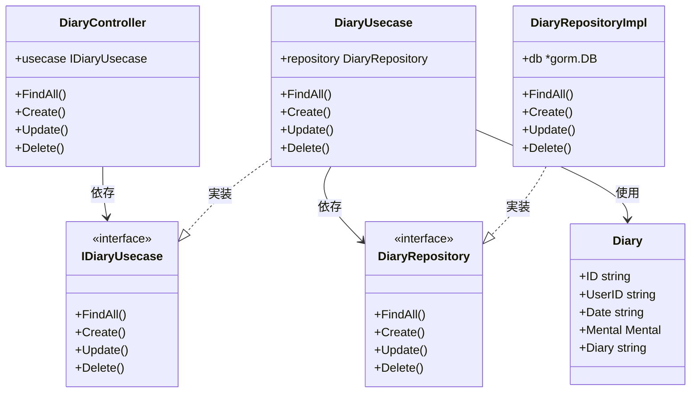
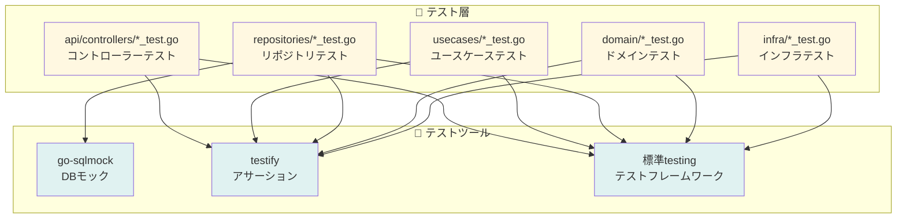

# TOFU NOTE Backend - オニオンアーキテクチャ（Mermaid図）

## 概要
TOFU NOTE Backendは、豆腐メンタルの可視化・記録アプリケーションのバックエンドAPIです。軽量DDD/オニオンアーキテクチャを採用し、保守性・拡張性を重視した設計となっています。

## オニオンアーキテクチャ構造図

### 1. 全体構造図

### 2. 依存関係の流れ図

### 3. 日記機能の詳細フロー

### 4. レイヤー間のインターフェース関係

### 5. データ変換フロー

```mermaid
flowchart LR
    A[HTTP Request<br/>JSON] --> B[Controller<br/>DTO変換]
    B --> C[Usecase<br/>ビジネスロジック]
    C --> D[Domain<br/>エンティティ]
    D --> E[Repository<br/>DBモデル変換]
    E --> F[GORM<br/>SQL実行]
    F --> G[PostgreSQL]
    
    G --> H[GORM<br/>結果取得]
    H --> I[Repository<br/>ドメイン変換]
    I --> J[Usecase<br/>結果返却]
    J --> K[Controller<br/>レスポンスDTO変換]
    K --> L[HTTP Response<br/>JSON]
    
    style A fill:#e3f2fd
    style B fill:#f3e5f5
    style C fill:#e8f5e8
    style D fill:#fff3e0
    style E fill:#fce4ec
    style F fill:#f1f8e9
    style G fill:#ffebee
    style H fill:#f1f8e9
    style I fill:#fce4ec
    style J fill:#e8f5e8
    style K fill:#f3e5f5
    style L fill:#e3f2fd
```

### 6. テスト構造図

## オニオンアーキテクチャの特徴

### 🎯 **依存関係の方向**
- 内側の層（ドメイン層）は外側の層に依存しない
- 外側の層は内側の層のインターフェースに依存
- 技術的な変更がビジネスロジックに影響しない

### 🧪 **テスタビリティ**
- 各層を独立してテスト可能
- モックを使用した単体テストが容易
- テーブル駆動テストで品質担保

### 🔧 **保守性・拡張性**
- 新機能追加時の影響範囲が限定的
- 技術スタック変更時の影響を最小化
- コードの責務が明確に分離

## 技術スタック

- **言語**: Go 1.24.1
- **Webフレームワーク**: Gin
- **ORM**: GORM
- **データベース**: PostgreSQL
- **認証**: JWT
- **API仕様**: OpenAPI/Swagger
- **テスト**: 標準testing + testify
- **マイグレーション**: golang-migrate

このアーキテクチャにより、TOFU NOTE Backendは保守性・拡張性に優れた、高品質なAPIを提供しています。 